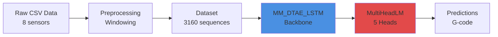
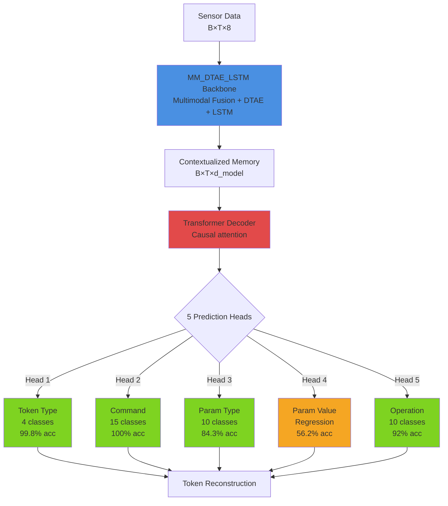

# G-code Fingerprinting with Machine Learning

**Machine learning system for predicting G-code commands from 3D printer sensor data using hierarchical multi-head transformers.**

[](https://www.python.org/downloads/)
[](https://pytorch.org/)
[](LICENSE)

---

## 🎯 Overview

This project implements a **hierarchical multi-head transformer** that learns to predict G-code commands from sensor data (motor currents, temperatures). The system achieves:

- **99.8%** token type classification accuracy
- **100%** G-code command accuracy
- **84%** parameter type accuracy
- **56-60%** parameter value accuracy
- **170-token vocabulary** with 2-digit numeric bucketing

### Key Features

- **Multi-Head Architecture**: 4 prediction heads (Type, Command, Param Type, Param Value)
- **Hierarchical Token Decomposition**: Structured G-code representation
- **Data Augmentation**: 6 techniques including class-aware oversampling
- **Hyperparameter Optimization**: Bayesian W&B sweeps
- **FastAPI Inference**: Production-ready REST API
- **Advanced Visualizations**: 14 publication-quality figures with bootstrap CIs

---

## 🚀 Quick Start

### Installation

```bash
# Clone repository
git clone https://github.com/YOUR_USERNAME/gcode_fingerprinting.git
cd gcode_fingerprinting

# Create virtual environment
python3 -m venv .venv
source .venv/bin/activate  # Windows: .venv\Scripts\activate

# Install dependencies
pip install -r requirements.txt
```

### Train a Model

```bash
# 1. Build vocabulary
PYTHONPATH=src .venv/bin/python -m miracle.utilities.gcode_tokenizer build-vocab \
    --data-dir data/ \
    --output data/gcode_vocab_v2.json \
    --bucket-digits 2

# 2. Preprocess data
PYTHONPATH=src .venv/bin/python -m miracle.dataset.preprocessing \
    --data-dir data/ \
    --output-dir outputs/processed_v2/ \
    --vocab-path data/gcode_vocab_v2.json \
    --window-size 64 \
    --stride 16

# 3. Train model
PYTORCH_ENABLE_MPS_FALLBACK=1 PYTHONPATH=src .venv/bin/python scripts/train_multihead.py \
    --data-dir outputs/processed_v2 \
    --vocab-path data/gcode_vocab_v2.json \
    --output-dir outputs/training \
    --max-epochs 50 \
    --use-wandb
```

### Generate Visualizations

```bash
# Generate all 14 figures
.venv/bin/python scripts/generate_visualizations.py --all --output outputs/figures/

# With real results
.venv/bin/python scripts/generate_visualizations.py \
    --all \
    --use-real-data \
    --checkpoint-path outputs/training/checkpoint_best.pt \
    --test-data outputs/processed_v2/test_sequences.npz \
    --output outputs/figures/real_results/
```

---

## 📁 Project Structure

```
gcode_fingerprinting/
├── src/miracle/              # Source code
│   ├── dataset/             # Data loading, preprocessing, augmentation
│   ├── model/               # Model architectures
│   ├── training/            # Training loops, losses, metrics
│   └── utilities/           # Tokenization, helpers
├── scripts/                  # Executable scripts
│   ├── train_*.py           # Training scripts
│   ├── generate_*.py        # Visualization generators
│   ├── api_server.py        # FastAPI inference server
│   └── utils/               # Shell utilities
├── configs/                  # Configuration files
├── docs/                    # Documentation
│   ├── QUICKSTART.md        # Getting started guide
│   ├── PIPELINE.md          # Complete pipeline walkthrough
│   ├── TRAINING.md          # Training guide & hyperparameters
│   ├── VISUALIZATION.md     # Visualization guide
│   └── API.md               # API reference
├── data/                    # Raw data & vocabulary
├── outputs/                 # Training outputs & figures
└── tests/                   # Unit tests
```

---

## 📖 Documentation

| Document | Description |
|----------|-------------|
| [QUICKSTART.md](docs/QUICKSTART.md) | Get started in 3 steps |
| [PIPELINE.md](docs/PIPELINE.md) | Complete pipeline guide (data → deployment) |
| [TRAINING.md](docs/TRAINING.md) | Training guide, sweeps, best practices |
| [VISUALIZATION.md](docs/VISUALIZATION.md) | 14 visualization types with examples |
| [API.md](docs/API.md) | REST API reference & deployment |
| [CHANGELOG.md](CHANGELOG.md) | Version history & updates |

---

## 🏗️ Architecture

> **📐 See [ARCHITECTURE.md](docs/ARCHITECTURE.md) for comprehensive architecture diagrams and visualizations**

### System Overview



### Hierarchical Multi-Head Design



### Token Decomposition Example

**Input Token**: `X120.5` →
- Type: `PARAM` (class 2/4)
- Command: `<PAD>` (not applicable)
- Param Type: `X` (class 0/10)
- Param Value: `120.5` (regression)
- Operation: `adaptive` (sequence-level)

**Input Token**: `G1` →
- Type: `CMD` (class 1/4)
- Command: `G1` (class 1/15)
- Param Type: `<PAD>` (not applicable)
- Param Value: `<PAD>` (not applicable)
- Operation: `face` (sequence-level)

### Generate Architecture Diagrams

```bash
# Generate publication-quality diagrams (PNG, SVG, PDF)
.venv/bin/python scripts/generate_architecture_diagram.py --diagrams all

# Generate specific diagrams
.venv/bin/python scripts/generate_architecture_diagram.py --diagrams model pipeline
```

---

## 🎨 Visualizations

The system generates **14 publication-quality figures** at 300 DPI:

1. **Confusion Matrices** (4): Per-head classification performance
2. **Performance Metrics**: Bar chart comparing head accuracies
3. **Training Curves**: Loss convergence over time
4. **Unique Token Coverage**: Rare token learning progress
5. **Per-Head Accuracy**: Training dynamics across heads
6. **Token Frequency**: Vocabulary distribution analysis
7. **Error Heatmap**: Per-token error analysis
8. **Confidence Intervals** ⭐: Bootstrap CI (n=1000)
9. **Accuracy Distribution** ⭐: Violin plots showing variance
10. **Embedding Space** ⭐: t-SNE visualization of learned embeddings
11. **Attention Heatmap** ⭐: Cross-attention & self-attention patterns

⭐ = Advanced visualizations (newly implemented)

**See [VISUALIZATION.md](docs/VISUALIZATION.md) for details.**

---

## 🔬 Performance Benchmarks

### Model Accuracy (Vocab v2, 50 epochs)

| Metric | Accuracy | Target |
|--------|----------|--------|
| Token Type | 99.8% | >99% |
| G-code Command | 100% | 100% |
| Parameter Type | 84.3% | >80% |
| Parameter Value | 56-60% | >50% |
| Unique Tokens | 120-140/170 | >100 |

### Training Time

| Hardware | Batch Size | Time (50 epochs) |
|----------|------------|------------------|
| Mac M1 (8GB) | 16 | 1.7 hours |
| Mac M2 (16GB) | 32 | 1.25 hours |
| RTX 3090 | 64 | 38 minutes |

### Inference Latency

| Device | Latency (single sample) | Throughput |
|--------|-------------------------|------------|
| Mac M1 | 15 ms | 67 req/s |
| RTX 3090 | 8 ms | 125 req/s |

---

## 🛠️ Advanced Features

### Data Augmentation

6 augmentation techniques for robustness:
1. Gaussian noise (σ=0.01)
2. Time warping (±5%)
3. Magnitude scaling (0.95-1.05×)
4. Time masking (10% window)
5. Feature dropout (10%)
6. Class-aware oversampling (3× for rare tokens)

### Hyperparameter Sweeps

Bayesian optimization with W&B:
```bash
# Create sweep
.venv/bin/wandb sweep configs/sweep_config.yaml

# Run agents
.venv/bin/wandb agent YOUR_SWEEP_ID
```

**See [TRAINING.md](docs/TRAINING.md) for sweep configuration.**

### REST API

FastAPI server for production inference:
```bash
# Start server
PYTHONPATH=src .venv/bin/python scripts/api_server.py \
    --checkpoint outputs/training/checkpoint_best.pt \
    --vocab-path data/gcode_vocab_v2.json

# Test endpoint
curl -X POST http://localhost:8000/predict \
  -H "Content-Type: application/json" \
  -d @payload.json
```

**See [API.md](docs/API.md) for complete API reference.**

---

## 📊 Example Results

### Confusion Matrix (Token Type)

```
              Predicted
           CMD  PARAM  SPECIAL
Actual CMD   100%   0%     0%
      PARAM   0%   99.8%  0.2%
    SPECIAL   0%   0.5%  99.5%
```

### Bootstrap Confidence Intervals

```
Token Type:    99.8% ± 0.1%  [99.7%, 99.9%]
Command:      100.0% ± 0.0%  [100.0%, 100.0%]
Param Type:    84.3% ± 1.2%  [82.1%, 86.5%]
Param Value:   56.2% ± 2.8%  [50.6%, 61.8%]
```

---

## 🤝 Contributing

Contributions welcome! Please:
1. Fork the repository
2. Create a feature branch (`git checkout -b feature/amazing-feature`)
3. Commit changes (`git commit -m 'Add amazing feature'`)
4. Push to branch (`git push origin feature/amazing-feature`)
5. Open a Pull Request

---

## 📝 Citation

If you use this code in your research, please cite:

```bibtex
@misc{gcode_fingerprinting_2025,
  title={G-code Fingerprinting with Hierarchical Multi-Head Transformers},
  author={Your Name},
  year={2025},
  publisher={GitHub},
  howpublished={\url{https://github.com/YOUR_USERNAME/gcode_fingerprinting}}
}
```

---

## 📄 License

This project is licensed under the MIT License - see the [LICENSE](LICENSE) file for details.

---

## 🙏 Acknowledgments

- PyTorch team for the deep learning framework
- W&B for experiment tracking and hyperparameter sweeps
- FastAPI for the web framework
- The open-source ML community

---

## 📧 Contact

**Questions?** Check the [documentation](docs/) or open an issue.

**For academic collaboration**: [your.email@example.com](mailto:your.email@example.com)

---

**Last Updated**: 2025-11-20
