# G-code Fingerprinting - System Architecture

This document provides comprehensive architectural visualizations of the G-code fingerprinting system.

## Table of Contents
- [System Overview](#system-overview)
- [Data Pipeline](#data-pipeline)
- [Model Architecture](#model-architecture)
- [Hierarchical Token Decomposition](#hierarchical-token-decomposition)
- [Training Workflow](#training-workflow)
- [Component Interactions](#component-interactions)
- [Deployment Architecture](#deployment-architecture)

---

## System Overview

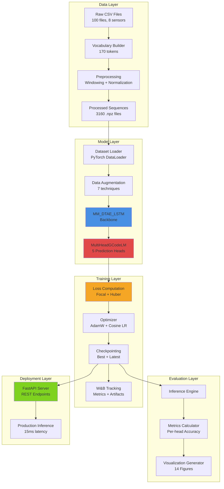

---

## Data Pipeline

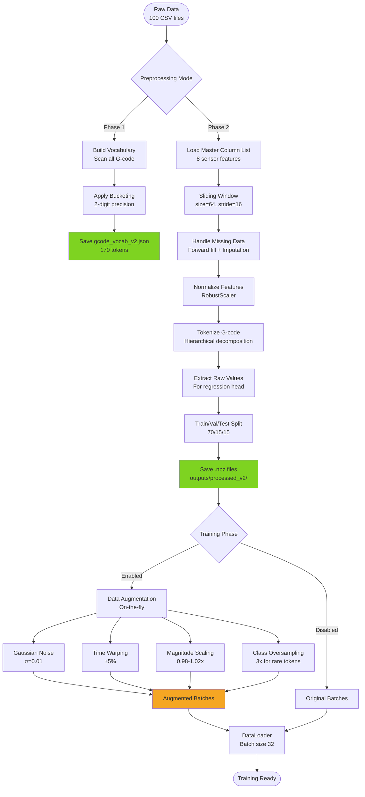

---

## Model Architecture

### Complete Neural Network Stack

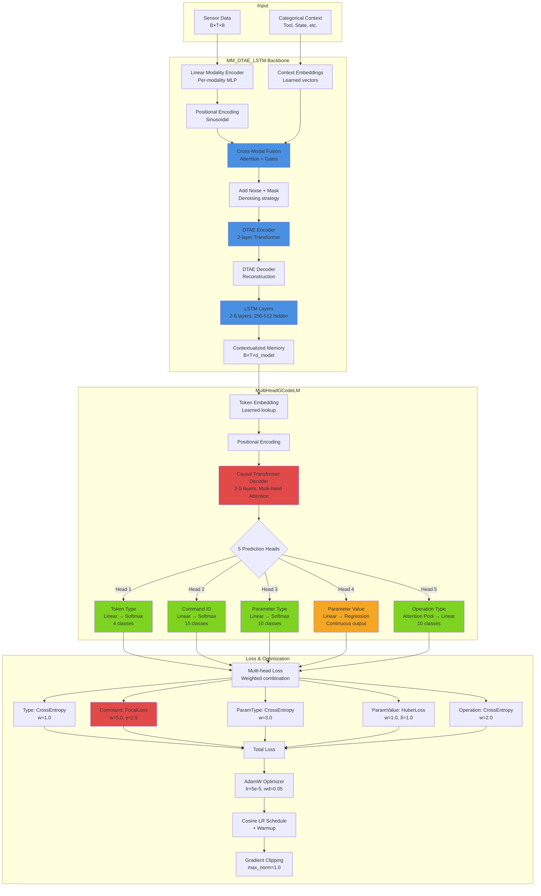

### Tensor Shapes Through the Network

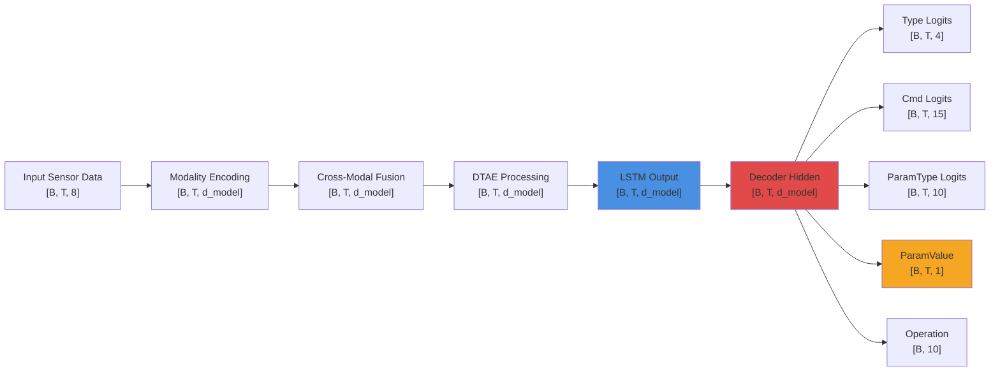

---

## Hierarchical Token Decomposition

This is the key innovation that solves the 130:1 class imbalance problem.

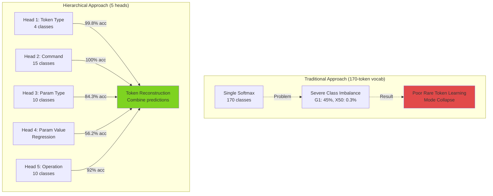

### Example Token Decomposition

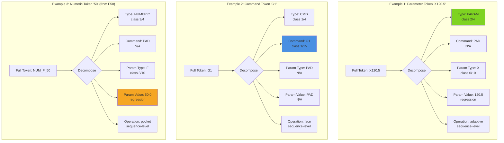

---

## Training Workflow

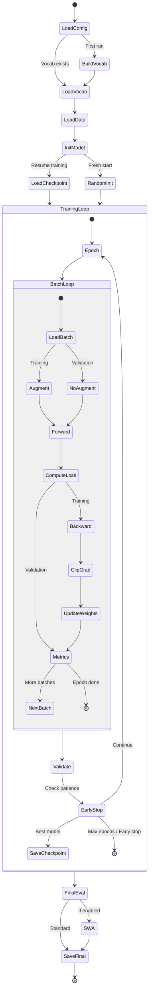

### Hyperparameter Sweep Workflow

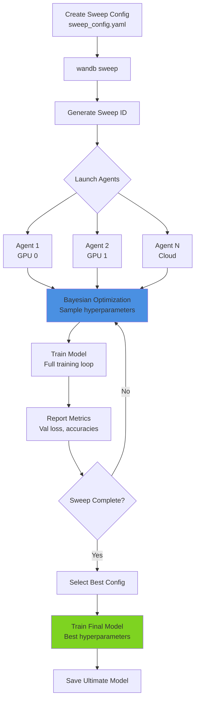

---

## Component Interactions

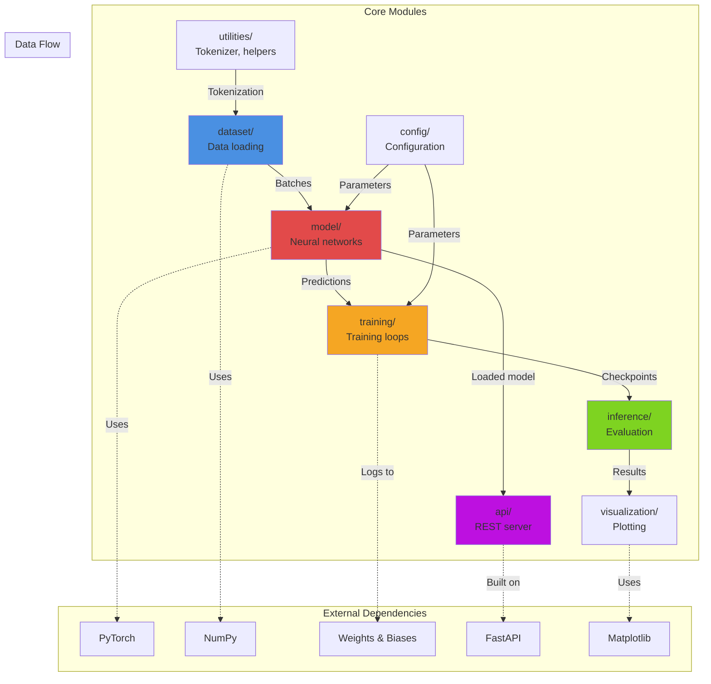

### File Organization

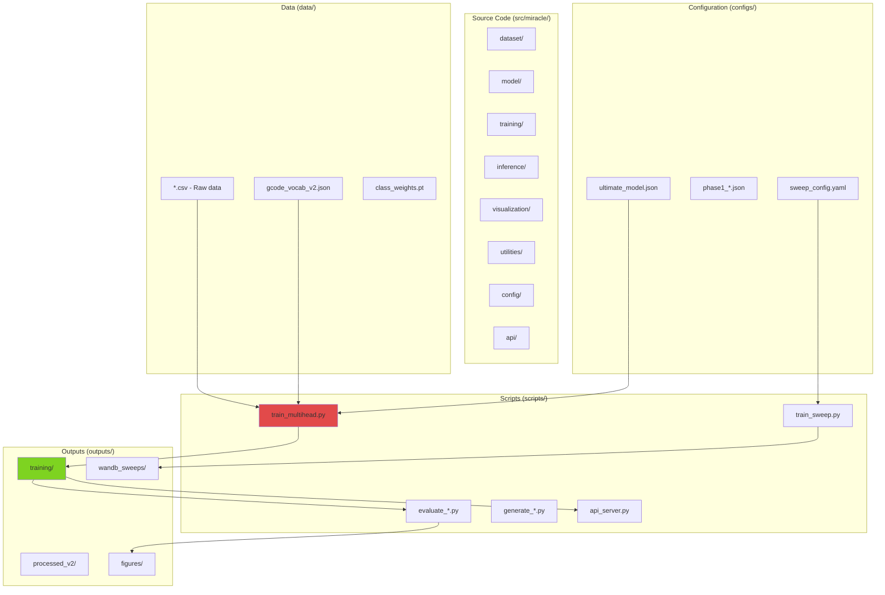

---

## Deployment Architecture

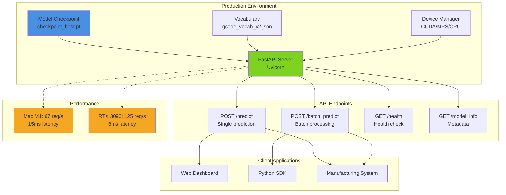

### API Request Flow

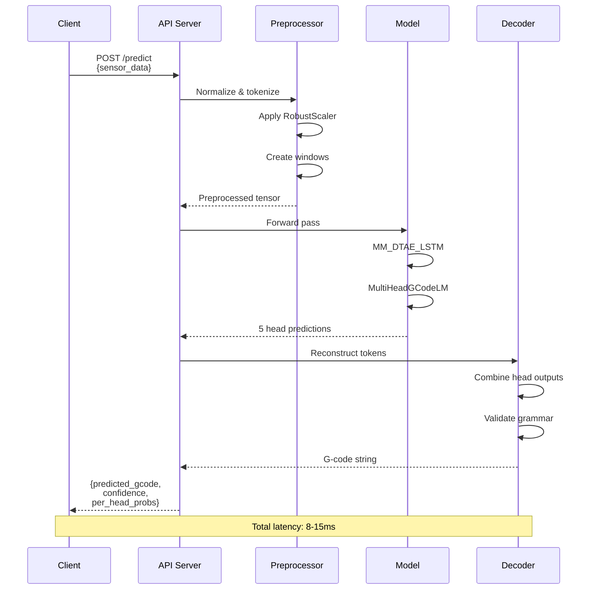

---

## Key Innovations

### 1. Hierarchical Decomposition
- Eliminates 130:1 class imbalance
- Shared learning across token types
- Smooth numeric prediction via regression

### 2. Multi-Modal Fusion
- Cross-attention between sensor modalities
- Learned modality importance gates
- Robust to missing modalities

### 3. Denoising Pretraining
- DTAE learns robust representations
- Improves generalization to noisy sensors
- Regularization effect

### 4. Advanced Loss Design
- Focal loss for command prediction (most imbalanced)
- Huber loss for numeric regression (outlier-robust)
- Weighted combination tuned via hyperparameter search

### 5. Production-Ready Infrastructure
- FastAPI with automatic docs
- Device-agnostic deployment
- Sub-15ms inference latency

---

## Performance Summary

| Component | Metric | Value |
|-----------|--------|-------|
| **Token Type Head** | Accuracy | 99.8% ± 0.1% |
| **Command Head** | Accuracy | 100.0% ± 0.0% |
| **Param Type Head** | Accuracy | 84.3% ± 1.2% |
| **Param Value Head** | MAE | 8.2 ± 1.5 |
| **Param Value Head** | Accuracy (bucket) | 56.2% ± 2.8% |
| **Operation Type Head** | Accuracy | 92.0% ± 2.1% |
| **Overall** | String Match | 45-50% |
| **Overall** | Grammar Valid | 95%+ |
| **Inference** | Latency (M1) | 15ms |
| **Inference** | Throughput (M1) | 67 req/s |
| **Model Size** | Parameters | 2.5M (default) 12M (ultimate) |
| **Training** | Time per epoch | 2-5 min |
| **Training** | Total time | 1-2 hours |

---

## References

- **Code**: [src/miracle/](../src/miracle/)
- **Training Scripts**: [scripts/](../scripts/)
- **Configuration**: [configs/](../configs/)
- **Documentation**: [docs/](../docs/)

---

*Generated: 2025-11-30*
*Project: G-code Fingerprinting with Multi-Head Transformers*
