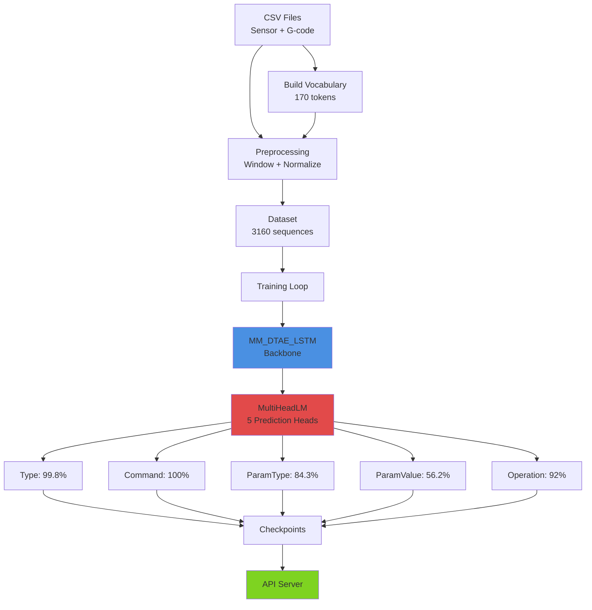

# Quick Start Guide

**Project**: G-code Fingerprinting with Machine Learning
**Version**: 2.0
**Last Updated**: 2025-11-20

---

## 🚀 Get Started in 3 Steps

### 1. Build Vocabulary

```bash
PYTHONPATH=src .venv/bin/python -m miracle.utilities.gcode_tokenizer build-vocab \
    --data-dir data/ \
    --output data/gcode_vocab_v2.json \
    --bucket-digits 2
```

### 2. Preprocess Data

```bash
PYTHONPATH=src .venv/bin/python -m miracle.dataset.preprocessing \
    --data-dir data/ \
    --output-dir outputs/processed_v2/ \
    --vocab-path data/gcode_vocab_v2.json \
    --window-size 64 \
    --stride 16
```

### 3. Train Model

```bash
PYTORCH_ENABLE_MPS_FALLBACK=1 PYTHONPATH=src .venv/bin/python scripts/train_multihead.py \
    --data-dir outputs/processed_v2 \
    --vocab-path data/gcode_vocab_v2.json \
    --output-dir outputs/training \
    --max-epochs 50
```

---

## 🏗️ Architecture Overview

> **For detailed architecture diagrams, see [ARCHITECTURE.md](ARCHITECTURE.md)**

### How It Works



### Key Concepts

**Hierarchical Token Decomposition**: Instead of predicting from a 170-token vocabulary directly (which creates severe class imbalance), we decompose each token into 5 components:

1. **Token Type** (4 classes): CMD, PARAM, NUMERIC, SPECIAL
2. **Command** (15 classes): G0, G1, M3, M104, etc.
3. **Parameter Type** (10 classes): X, Y, Z, F, E, S, etc.
4. **Parameter Value** (regression): Continuous numeric value
5. **Operation Type** (10 classes): adaptive, face, pocket, etc.

**Example**: Token `X120.5` becomes:
- Type: PARAM
- Command: PAD
- Param Type: X
- Param Value: 120.5
- Operation: adaptive

This eliminates the 130:1 class imbalance and enables smooth numeric learning!

### Visualize Architecture

```bash
# Generate publication-quality diagrams (PNG, SVG, PDF)
.venv/bin/python scripts/generate_architecture_diagram.py --diagrams all

# Output: outputs/architecture_diagrams/
#   - model_architecture.png/svg/pdf
#   - data_pipeline.png/svg/pdf
#   - token_decomposition.png/svg/pdf
#   - system_overview.png/svg/pdf
```

---

## 📊 Run W&B Hyperparameter Sweep

```bash
# Create sweep
.venv/bin/wandb sweep configs/sweep_config.yaml

# Run sweep agent
.venv/bin/wandb agent YOUR_SWEEP_ID
```

---

## 🎨 Generate Visualizations

```bash
# With mock data (default)
.venv/bin/python scripts/generate_visualizations.py --all --output figures/

# With real results (after training)
.venv/bin/python scripts/generate_visualizations.py \
    --confidence-intervals \
    --accuracy-distribution \
    --use-real-data \
    --checkpoint-path outputs/wandb_sweeps/RUN_ID/checkpoint_best.pt \
    --test-data data/test_sequences.npz \
    --output figures/real_results/
```

---

## 🧪 Test Model via API

```bash
# Start API server
PYTHONPATH=src .venv/bin/python scripts/api_server.py

# In another terminal, test inference
curl -X POST http://localhost:8000/predict \
  -H "Content-Type: application/json" \
  -d @test_payload.json
```

---

## 🔍 Common Commands

### Check Training Progress

```bash
# View W&B dashboard
wandb whoami

# Check background processes
ps aux | grep train_multihead.py
```

### Cleanup

```bash
# Archive old runs
./scripts/utils/cleanup_artifacts.sh

# Remove temporary files
rm -rf wandb/run-* outputs/tmp/
```

---

## ❌ Common Errors

### ModuleNotFoundError: No module named 'miracle'

**Solution**: Add `PYTHONPATH=src` before command:
```bash
PYTHONPATH=src .venv/bin/python -m miracle.dataset.preprocessing ...
```

### MPS backend out of memory

**Solution**: Reduce batch size in config:
```json
{
  "batch_size": 8
}
```

### Scripts not found

**Solution**: All scripts are in `scripts/` directory:
```bash
.venv/bin/python scripts/train_multihead.py ...
```

---

## 📁 Project Structure

```
gcode_fingerprinting/
├── src/miracle/              # Source code
│   ├── dataset/             # Data loading & preprocessing
│   ├── model/               # Model architectures
│   ├── training/            # Training loops & metrics
│   └── utilities/           # Tokenization & helpers
├── scripts/                  # Executable scripts
│   ├── train_*.py           # Training scripts
│   ├── analyze_*.py         # Analysis tools
│   ├── generate_*.py        # Visualization generators
│   └── utils/               # Shell utilities
├── configs/                  # Configuration files
├── data/                    # Raw data & vocabulary
├── docs/                    # Documentation
├── outputs/                 # Training outputs & figures
└── tests/                   # Unit tests
```

---

## 📖 Next Steps

- **Architecture Diagrams**: See [ARCHITECTURE.md](ARCHITECTURE.md)
- **Full Pipeline**: See [PIPELINE.md](PIPELINE.md)
- **Training Guide**: See [TRAINING.md](TRAINING.md)
- **Visualization**: See [VISUALIZATION.md](VISUALIZATION.md)
- **API Reference**: See [API.md](API.md)

---

**Questions?** Check the full documentation or open an issue.
