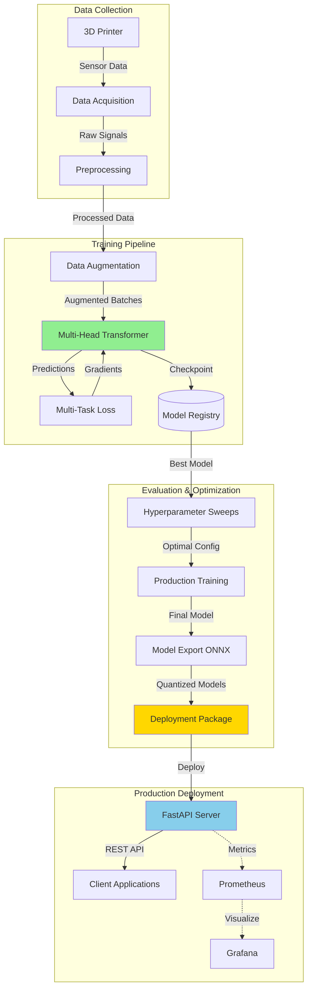
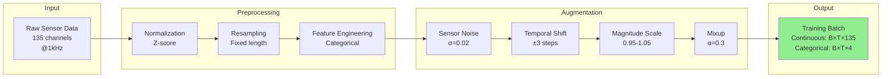
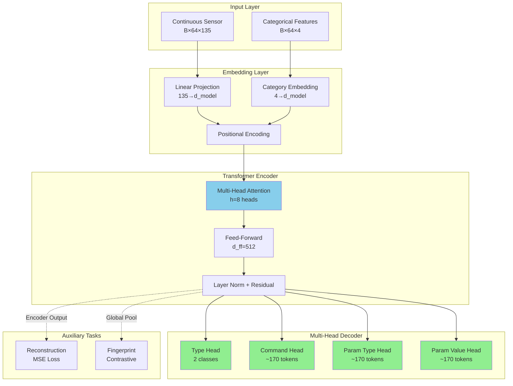
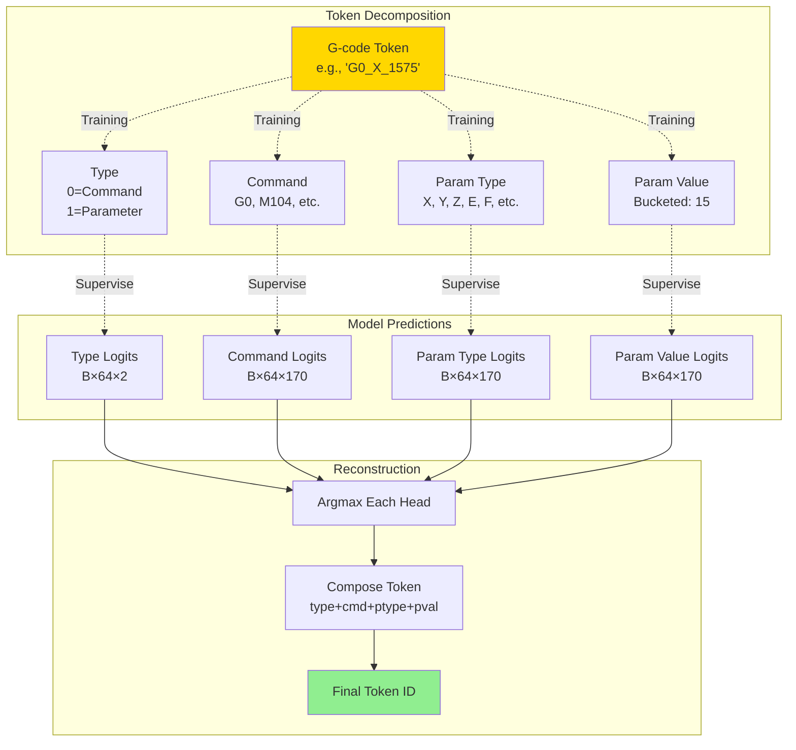
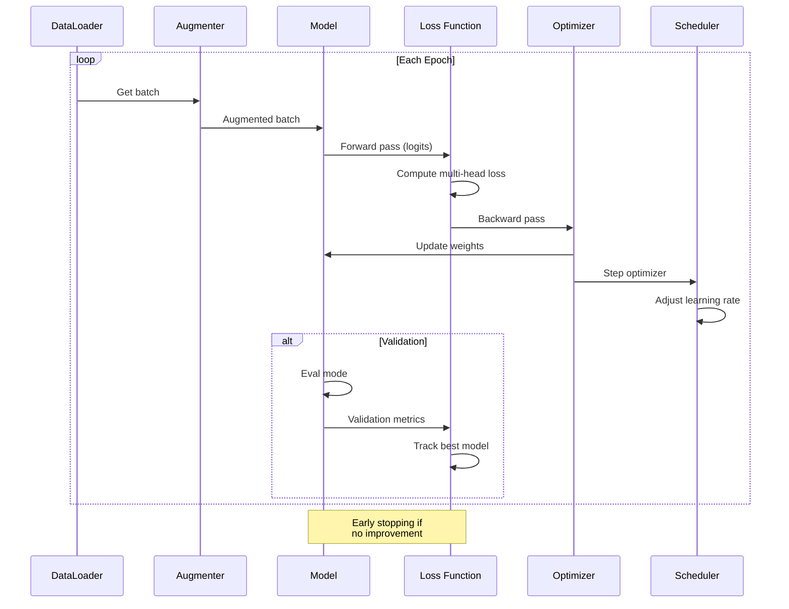
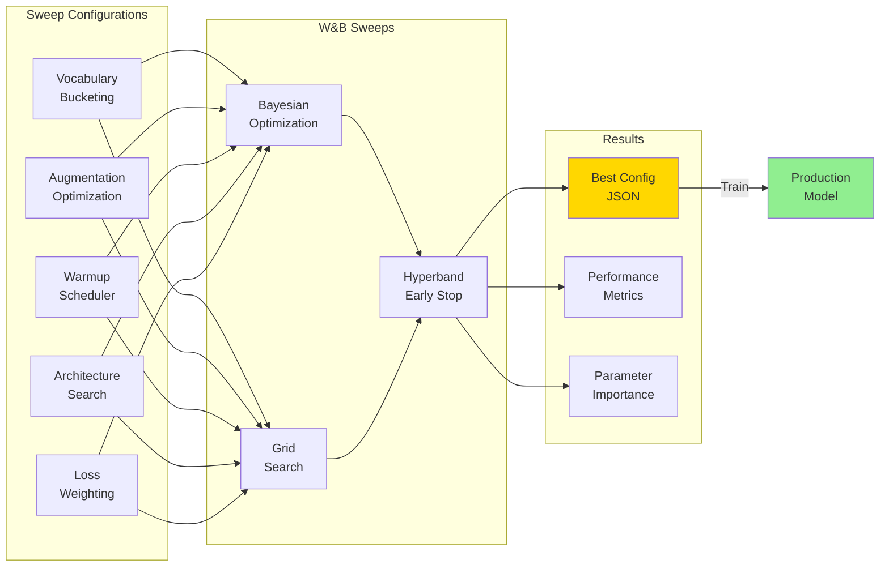
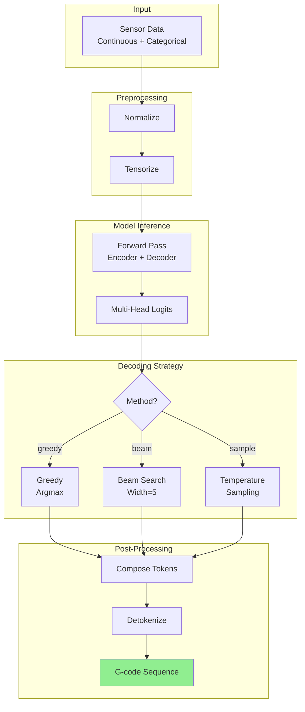
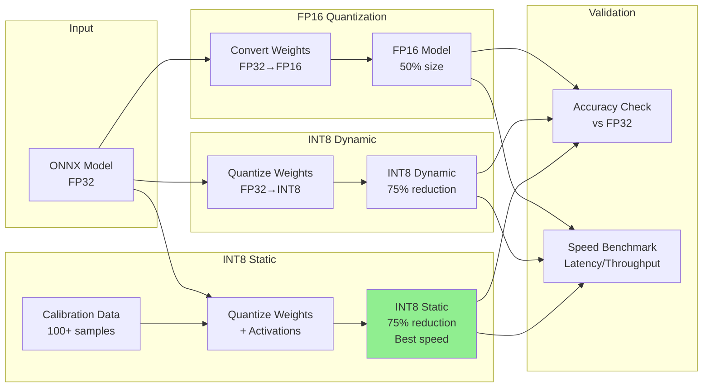
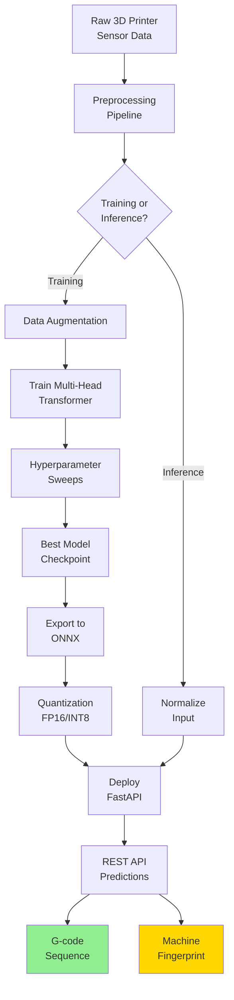

# System Architecture Overview

This document provides visual architecture diagrams for the G-code fingerprinting system.

---

## 1. High-Level System Architecture



---

## 2. Data Processing Pipeline



---

## 3. Model Architecture



---

## 4. Multi-Head Token Decomposition



---

## 5. Training Loop



---

## 6. Hyperparameter Optimization



---

## 7. Inference Pipeline



---

## 8. Production Deployment

```mermaid
graph TB
    subgraph "Model Artifacts"
        A[PyTorch<br/>Checkpoint]
        B[ONNX<br/>FP32]
        C[ONNX<br/>FP16]
        D[ONNX<br/>INT8]
    end

    subgraph "Docker Container"
        E[FastAPI<br/>Server]
        F[Model Manager<br/>Singleton]
        G[Inference<br/>Engine]
    end

    subgraph "API Endpoints"
        H[/predict]
        I[/batch_predict]
        J[/fingerprint]
        K[/health]
    end

    subgraph "Clients"
        L[Python<br/>Client]
        M[Web<br/>Dashboard]
        N[Edge<br/>Device]
    end

    subgraph "Monitoring"
        O[Prometheus]
        P[Grafana]
    end

    A -->|Export| B
    B -->|Quantize| C & D

    B & C & D --> F
    F --> G
    G --> H & I & J & K

    H & I & J --> L & M & N

    E -.->|Metrics| O
    O -.->|Visualize| P

    style E fill:#87CEEB
    style G fill:#90EE90
```

---

## 9. Quantization Workflow



---

## 10. End-to-End Workflow



---

## Diagram Legend

- **Green boxes**: Final outputs/results
- **Blue boxes**: Core components/services
- **Yellow boxes**: Important artifacts
- **Dotted lines**: Monitoring/auxiliary flows
- **Solid lines**: Main data/control flow

---

## Component Descriptions

### Data Collection
- **3D Printer**: RepRap/Prusa machines with sensor arrays
- **Data Acquisition**: Real-time sensor reading (1kHz sampling)
- **Preprocessing**: Normalization, resampling, feature engineering

### Model Training
- **Multi-Head Transformer**: Encoder-decoder architecture
- **Data Augmentation**: Noise, shifts, scaling, mixup
- **Multi-Task Loss**: Command + parameter + auxiliary losses

### Hyperparameter Optimization
- **W&B Sweeps**: Bayesian optimization + Hyperband
- **5 Major Sweeps**: Vocabulary, augmentation, warmup, architecture, loss
- **300+ Experiments**: Systematic search for >70% accuracy

### Production Deployment
- **ONNX Export**: Cross-platform model format
- **Quantization**: FP16 (2x speedup), INT8 (3-4x speedup)
- **FastAPI**: REST API with auto-documentation
- **Docker**: Containerized deployment with monitoring

---

**Last Updated:** November 19, 2025
