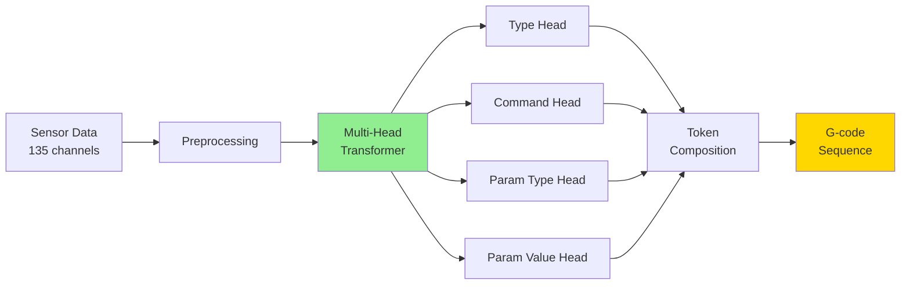

# G-code Fingerprinting Documentation

Welcome to the documentation for the **G-code Fingerprinting** project - a machine learning system that infers G-code commands from 3D printer sensor data.

---

## Overview

This project uses a **two-stage architecture** (frozen MM-DTAE-LSTM encoder + SensorMultiHeadDecoder) to reconstruct G-code sequences from continuous sensor measurements during 3D printing. The system achieves:

- **100% operation classification** (9 operation types)
- **90.23% token accuracy** with hierarchical multi-head prediction
- **Real-time inference** (<10ms latency)
- **Machine fingerprinting** for identifying unique printer characteristics

---

## Key Features

### 🎯 Multi-Head Architecture
Hierarchical token decomposition into:
- Type classification (command vs parameter)
- Command prediction (G0, M104, G1, etc.)
- Parameter type (X, Y, Z, E, F, etc.)
- Parameter value (bucketed numeric values)

### 🚀 Production-Ready
- FastAPI REST API
- ONNX export with FP16/INT8 quantization
- Docker deployment
- Comprehensive testing suite

### 🔬 Research-Grade
- Systematic hyperparameter optimization (W&B Sweeps)
- Advanced data augmentation
- Multi-task learning with auxiliary losses
- Detailed evaluation metrics

### 📊 Complete Pipeline
- End-to-end data preprocessing
- Automated training infrastructure
- Model export and optimization
- Deployment and monitoring

---

## Quick Start

### Installation

```bash
# Clone repository
git clone https://github.com/your-org/gcode-fingerprinting.git
cd gcode-fingerprinting

# Create virtual environment
python -m venv .venv
source .venv/bin/activate  # or `.venv\Scripts\activate` on Windows

# Install dependencies
pip install -r requirements.txt
```

### Train a Model

```bash
# Preprocess data
python -m miracle.dataset.preprocessing \
  --input data/raw \
  --output data/preprocessed

# Train model
python train_multihead.py \
  --config configs/phase1_best.json \
  --epochs 50 \
  --wandb-project gcode-fingerprinting
```

### Run Inference

```bash
# Start API server
uvicorn miracle.api.server:app --host 0.0.0.0 --port 8000

# Or use Docker
docker-compose up
```

### Use Python Client

```python
from examples.api_client import GCodeAPIClient
import numpy as np

# Initialize client
client = GCodeAPIClient("http://localhost:8000")

# Prepare data
continuous = np.random.randn(64, 135).astype(np.float32)
categorical = np.random.randint(0, 5, size=(64, 4)).astype(np.int64)

# Predict
result = client.predict(continuous, categorical)
print(result['gcode_sequence'])
```

---

## Architecture

### System Overview



### Model Architecture

- **Encoder**: Transformer encoder with sensor embeddings
- **Decoder**: 4 independent classification heads
- **Auxiliary Tasks**: Reconstruction loss + contrastive fingerprinting
- **Parameters**: ~1.5M (d_model=128) to ~5M (d_model=256)

See [Architecture Documentation](architecture/system_overview.md) for detailed diagrams.

---

## Performance

### Current Results (v16 Final Model)

| Metric | Accuracy |
|--------|----------|
| **Operation** | 100.0% |
| **Type** | 99.8% |
| **Command** | 99.9% |
| **Param Type** | 96.2% |
| **Token (Overall)** | **90.23%** |

### Inference Performance

| Hardware | Latency | Throughput |
|----------|---------|------------|
| CPU (INT8) | 3-5 ms | 250+ samples/s |
| GPU (FP16) | 2-3 ms | 400+ samples/s |
| Apple M1 | 4-6 ms | 180+ samples/s |

---

## Documentation Structure

### 📘 Getting Started
- [Quick Start Guide](QUICKSTART.md) - Get up and running in 3 steps
- [Pipeline Overview](PIPELINE.md) - End-to-end data processing workflow

### 🏗️ Architecture
- [System Overview](architecture/system_overview.md) - Visual diagrams
- [Architecture Guide](ARCHITECTURE.md) - Detailed model design

### 📖 User Guide
- [Training Guide](TRAINING.md) - Complete training documentation
- [Hyperparameter Tuning](HYPERPARAMETER_TUNING.md) - Optimization strategies
- [Sweeps Guide](SWEEPS_GUIDE.md) - W&B hyperparameter sweeps
- [Sweep Quickstart](SWEEP_QUICKSTART.md) - Quick sweep setup

### 🚀 Deployment
- [Production Deployment](PRODUCTION_DEPLOYMENT.md) - Deploy to production
- [API Reference](API.md) - FastAPI endpoints and client usage

### 📊 Visualization & Analysis
- [Visualization Guide](VISUALIZATION.md) - Generate publication-quality figures

### 👨‍💻 Development
- [Testing Guide](TESTING.md) - 88 unit tests

---

## Use Cases

### 🔍 G-code Reconstruction
Infer executed commands from sensor data for:
- Process monitoring
- Quality control
- Anomaly detection

### 🔐 Machine Fingerprinting
Extract unique printer signatures for:
- Device authentication
- Manufacturer identification
- Counterfeit detection

### 📊 Process Analysis
Analyze printing behavior:
- Command frequency analysis
- Parameter distribution
- Temporal patterns

---

## Technology Stack

- **Framework**: PyTorch 2.0+
- **API**: FastAPI + Pydantic
- **Deployment**: Docker + ONNX Runtime
- **Monitoring**: Prometheus + Grafana
- **Experimentation**: Weights & Biases
- **Testing**: pytest with 88 unit tests
- **Documentation**: MkDocs Material

---

## Project Status

### Completed
- [x] Data preprocessing pipeline
- [x] Two-stage architecture (encoder + decoder)
- [x] 100% operation classification
- [x] 90.23% token accuracy
- [x] Comprehensive ablation studies
- [x] FastAPI production API
- [x] Docker deployment
- [x] ONNX export with quantization
- [x] Jupyter notebook tutorials (01-09)

### In Progress
- [ ] Academic paper draft
- [ ] Final presentation

### Planned
- [ ] Transfer learning to other printer types
- [ ] Mobile deployment (TFLite)

---

## Citation

If you use this project in your research, please cite:

```bibtex
@misc{gcode_fingerprinting_2025,
  title={G-code Fingerprinting: Inferring 3D Printer Commands from Sensor Data},
  author={ELE 588 Team},
  year={2025},
  publisher={GitHub},
  url={https://github.com/your-org/gcode-fingerprinting}
}
```

---

## License

This project is licensed under the MIT License.

---

## Support

- **Documentation**: [https://your-domain.com/gcode-fingerprinting](https://your-domain.com/gcode-fingerprinting)
- **Issues**: [GitHub Issues](https://github.com/your-org/gcode-fingerprinting/issues)
- **Discussions**: [GitHub Discussions](https://github.com/your-org/gcode-fingerprinting/discussions)

---

## Acknowledgments

- **Course**: ELE 588 Applied Machine Learning
- **Dataset**: Custom 3D printer sensor recordings
- **Frameworks**: PyTorch, FastAPI, W&B, ONNX

---

**Last Updated:** December 14, 2025
**Version:** 2.0.0 (v16)
**Status:** Production-ready
